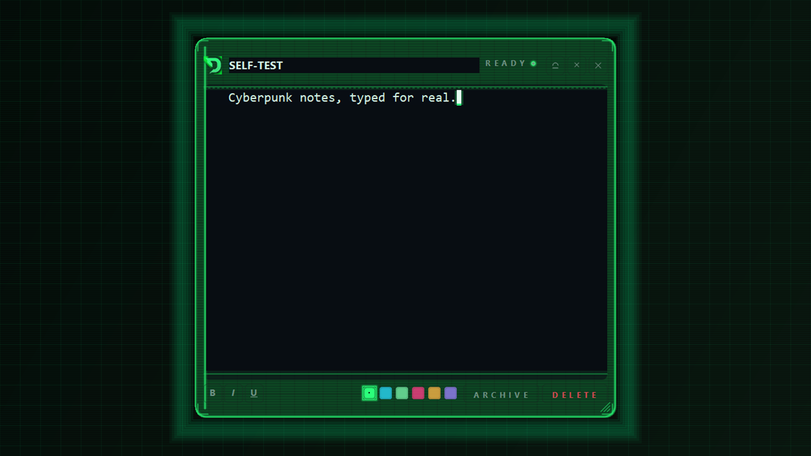
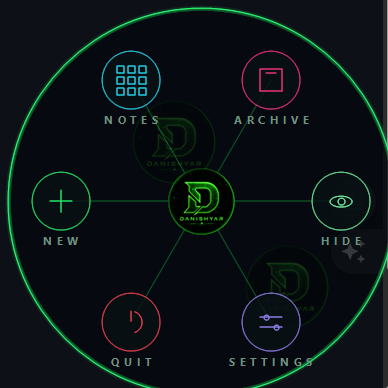
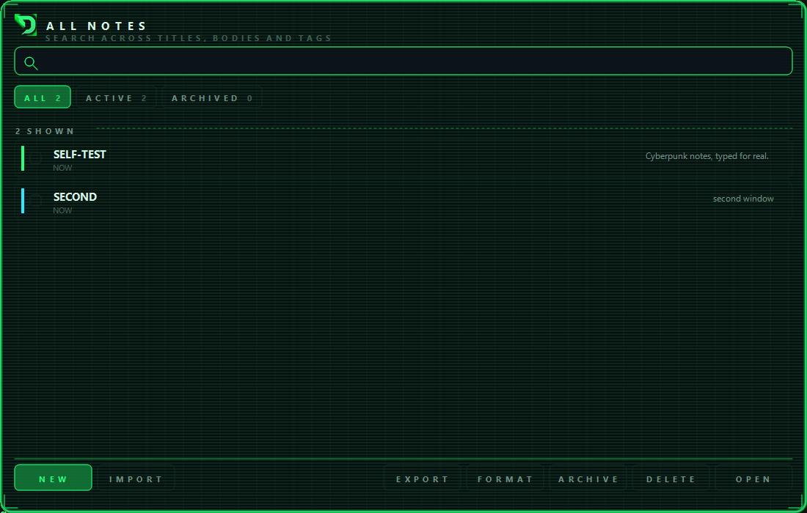
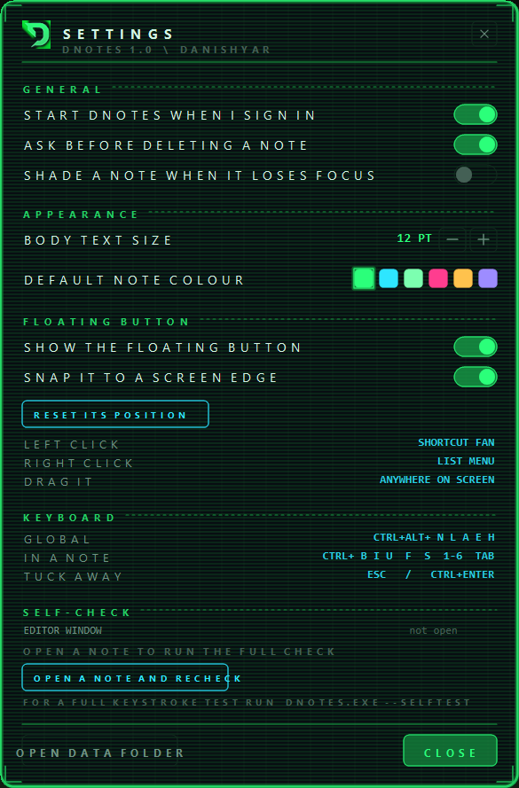

<div align="center">



# DNotes

**Cyberpunk sticky notes for Windows, reduced to a single floating button.**

[](LICENSE)
[](src/DNotes.csproj)
[](#run-it)
[](#prove-it-to-yourself)
[](src)
[](LICENSE)

One floating **DANISHYAR** button is the entire app. Park it anywhere on your desktop,
click it for a shortcut fan, and a note opens with a keystroke. Notes save to disk a
quarter second after you stop typing. No account, no server, no telemetry.

[Download](#download) · [Run it](#run-it) · [Build from source](#build-from-source) · [Roadmap](#roadmap)

</div>

---

## Contents

- [The floating button](#the-floating-button)
  - [If you hide the button, how do you get it back?](#if-you-hide-the-button-how-do-you-get-it-back)
- [Run it](#run-it)
- [You can write on it](#you-can-write-on-it)
  - [Prove it to yourself](#prove-it-to-yourself)
  - [Nothing can kill it quietly](#nothing-can-kill-it-quietly)
- [Using it](#using-it)
  - [Finding a note](#finding-a-note)
  - [In a note](#in-a-note)
  - [Everywhere](#everywhere)
  - [All Notes](#all-notes)
- [Your notes are yours](#your-notes-are-yours)
- [Settings](#settings)
- [Download](#download)
- [Build from source](#build-from-source)
- [Notes on the build](#notes-on-the-build)
- [Roadmap](#roadmap)
- [Credits](#credits)
- [License](#license)

---

## The floating button


An AssistiveTouch-style orb carrying your emblem, parked anywhere on the desktop.

- **Left click** opens a radial fan — six shortcuts on a hexagonal ring joined by neon
  spokes, with the orb at the centre.

  

- **Right click** opens a plain list, for when the fan is more ceremony than you want.
- **Drag it** anywhere. Let go near a screen edge and it snaps, the way AssistiveTouch
  does on a phone.
- It **never takes focus while you are typing** — `WS_EX_NOACTIVATE` from handle
  creation, and the foreground is handed straight back if anything disturbs it.
- The corners are genuinely transparent, so it only ever intercepts a click on its own
  72 pixels and never blocks the desktop behind it.
- Position is remembered. Turn it off, or reset it, in **Settings → FLOATING BUTTON**.

### If you hide the button, how do you get it back?

The button is the only thing on your desktop, so hiding it is not a trap. Any of these
brings it straight back:

| | |
|---|---|
| **`Ctrl`+`Alt`+`B`** | The shortcut reveals the button *and* opens its menu in one go. It is never a dead key. |
| **Right-click the tray icon** | The row reads **SHOW THE BUTTON** whenever the button is hidden. |
| **`Ctrl`+`Alt`+`H`** | Toggles everything on and off, button included. |
| **Settings → FLOATING BUTTON** | Untick "Show the floating button" to see it again. |

If you hide it in Settings, a line appears right underneath telling you so. There is a
self-test that hides the button and then exercises all three escape hatches, so a lockout
cannot ship unnoticed.

Your `D.ico` is a square with **opaque black corners**, so it could not be floated as-is
— it would have been a black square. It is cut to a disc with a feathered edge at build
time, and that disc is the entire button: no halo, no outer ring, no extra chrome, so the
window is exactly the size of your logo and covers the least desktop possible. There is a
self-test check that samples the corner pixels for zero alpha, so a black square can never
ship.

---

## Run it

1. Unzip anywhere you like.
2. Double-click **`DNotes.exe`**.

That is the whole install. No runtime to download, no installer, no admin rights.
It is a single ~1 MB executable that runs on Windows 10 (1903+) and Windows 11 using
the .NET Framework 4.8 that already ships with Windows.

The floating button appears in the bottom-right of your screen and a **DNotes** icon goes
to the system tray. That is where it lives — quitting from the tray icon shuts it down.

---

## You can write on it

This is the whole point, so it is worth being blunt about how it is guaranteed.

| Guarantee | How |
|---|---|
| The body is a real Win32 `RichTextBox` | Not a canvas, not a web view. Caret, selection, IME, clipboard and undo all come from the OS. |
| Nothing is ever layered on top of the editor | The note window paints its own chrome and places exactly **two** child controls: the title field and the body. No overlay, no transparent effects panel, no third control near the text. Anything on top would eat the mouse. |
| The window never suppresses its own input | `WS_EX_TRANSPARENT` and `WS_EX_NOACTIVATE` are explicitly cleared on note windows. |
| Focus is guaranteed on activation | Every note window puts the caret back in the body whenever it comes to the front, unless you are deliberately in the title or find field. |
| Shortcuts cannot eat a keystroke | Every shortcut is a Ctrl or Ctrl+Alt chord handled in `ProcessCmdKey`. Anything else is handed straight back to the editor. |
| The caret is actually visible | A stock `RichTextBox` draws a near-black caret, which vanishes on a dark note. DNotes hides the native caret and paints a blinking neon block in the control's own paint, so you can always see where you are typing. |
| Tab indents, it does not escape | Tab indents the note instead of jumping focus into the title field, where a stray keystroke would edit the wrong thing. |
| A note can always be made bigger | The note window is borderless, so it has no OS frame to drag. DNotes draws its own grips on all four edges and corners, with a visible handle in the bottom-right, and the size is remembered per note. |

### Resizing a note

Because the window is `FormBorderStyle.None`, there is no system frame to grab — which is
exactly why an earlier build felt stuck at whatever size it opened at. DNotes handles it
itself:

- **Drag any edge or corner.** The bottom-right corner carries a visible grip hint.
- The cursor changes to the matching resize arrow, so you know what you have hold of.
- Limits are **280 × 190** minimum and **900 × 1100** logical maximum, and the floor is
  set by measurement: the footer's own buttons stop fitting below 275 logical, so a note
  narrower than that would stack its own controls on top of each other.
- Stored geometry is in **logical units**, so a note keeps its apparent size if you move
  it between a 100% and a 125% display.

### Prove it to yourself

```
DNotes.exe --selftest
```

This is not a unit test. It opens a real note window, gives it real keyboard focus,
pushes real keystrokes through the Win32 input queue with `SendInput`, and reads the
editor back — then samples the actual screen pixels to confirm the caret is lit. It
also sweeps a synthetic mouse across every control, and drags the resize grips for real.
**87 checks**, including:

```
[PASS] synthetic keystrokes reached the editor            "Hello from DNotes 12345" is in the buffer
[PASS] the editor holds keyboard focus                    GetFocus -> 0x183097E (editor)
[PASS] a click in the body reaches the editor             WindowFromPoint -> editor
[PASS] hovering the header buttons does not throw         pin, shade and close all swept clean
[PASS] the header buttons show a hand cursor              3 of 3 header buttons showed a hand cursor
[PASS] clicking an accent swatch changes the note colour  accent 0 -> 1 (wanted 1)
[PASS] caret is painted and visible on screen             21 lit pixels in the caret at {X=444,Y=121,Width=7,Height=24}
[PASS] a borderless note can be dragged bigger            425x475  ->  568x628
[PASS] the writing area grew with the note                editor 393x293  ->  536x474
[PASS] a note cannot be dragged past its maximum          held at 1125 (ceiling 1125)
[PASS] the note's minimum width is wide enough for its own footer     widest colliding = none, over 133 widths
[PASS] the button is a circle with transparent corners    max corner alpha = 0 (must be 0) and centre = 255
[PASS] the button never takes keyboard focus             24B09E8 was never foreground across 12 samples while the fan was open
[PASS] it snaps to the edge you drop it near              gap from the right edge = 0px (snap radius 32)
[PASS] the floating button is the only thing on the desktop    no other always-on window exists
[PASS] deleting from all-notes removes the row            visible 2 -> 1
[PASS] the deleted note is gone from disk too             1 .dnote files, was 2
[PASS] no unhandled exception was swallowed during the run     the process-level guard caught nothing
```

Handle addresses and pixel coordinates below are from one real run and differ every time;
[`SELFTEST.txt`](SELFTEST.txt) has the full report for the shipped build.

The full report from the shipped build is in [`SELFTEST.txt`](SELFTEST.txt), and
**Settings → SELF-CHECK** shows the same read-out live while the app is running.

> The self-test is not run in CI. It needs an interactive desktop session, because it
> drives real input through the Win32 queue — a headless runner would only ever report a
> false failure. Run it locally with `.\scripts\build.ps1`.

### Nothing can kill it quietly

DNotes lives in your tray all day, so an unhandled exception must not take it out of
service with a .NET crash dialog and take your notes with it. A process-level handler
logs anything that escapes, tells you once through a tray balloon, and carries on:

```
%APPDATA%\DNotes\dnotes.log
```

The self-test counts anything the guard catches and **fails the run** if it caught
something, so a silently "handled" feature cannot hide again.

---

## Using it

### Finding a note

There is one control on your desktop. To open something:

1. **Click the button** for the shortcut fan, then **NOTES** for the searchable list.
2. **Double-click a note** to open it, or press `Enter`.
3. Or press `Ctrl`+`Alt`+`L` to jump straight to the list.

### In a note

| Key | Does |
|---|---|
| *(just type)* | Write. Saves 250 ms after you stop. |
| `Ctrl`+`B` `I` `U` | Bold, italic, underline |
| `Ctrl`+`F` | Find inside the note (the bar replaces the footer, never covers your text) |
| `Ctrl`+`1`…`6` | Change the note's neon colour |
| `Ctrl`+`Tab` | Jump to the next note — `Ctrl`+`Shift`+`Tab` for the previous |
| `Ctrl`+`S` | Save now |
| `Ctrl`+`N` | Jump to the title |
| `Tab` | Indent |
| `Esc` | Tuck the note away |
| `Ctrl`+`Enter` | Tuck away / bring back |

The footer has bold/italic/underline, the six accent colours, archive and delete. On a
narrow note the palette drops to its own row rather than losing colours off the end.

### Everywhere

| Key | Does |
|---|---|
| `Ctrl`+`Alt`+`N` | New note |
| `Ctrl`+`Alt`+`L` | All Notes |
| `Ctrl`+`Alt`+`A` | Archive view |
| `Ctrl`+`Alt`+`B` | Open the floating button's shortcut fan |
| `Ctrl`+`Alt`+`H` | Hide / show everything |

### All Notes



Search runs across titles, bodies and tags as you type. Filter to **All**, **Active** or
**Archived**. Select with `Ctrl`+click or `Ctrl`+`A` for all, then remove them with the
**DELETE** button or the `Delete` key — either way you get a confirmation, and the note
goes to `%APPDATA%\DNotes\trash\` rather than vanishing. Export the selection as
**Markdown** (one `.md` per note), **plain text**, a **single document**, or a
**`.dnotes` archive** that imports back with colours, states and dates intact. `IMPORT`
reads those archives, and any plain text or `.md` file, back in.

> `DELETE` and `OPEN` are both disabled until you tick a row, so a stray click can never
> remove a note you did not mean to remove. Destructive actions in this app are always
> explicit.

---

## Your notes are yours

- **One plain JSON file per note** in `%APPDATA%\DNotes\notes\`, each named `<id>.dnote`.
  Open it in any text editor, back it up with any tool, put the folder in OneDrive or
  Dropbox and it syncs on its own.
- **Writes are atomic** — a temp file and a replace, so a crash mid-save cannot truncate
  a note.
- **Deletes leave a copy** in `%APPDATA%\DNotes\trash\`.
- **No account, no server, no analytics, no telemetry.** Nothing leaves the machine. The
  only registry write is the `Run` key entry for autostart, and you can turn that off.
- **Encoding is RTF**, so bold, italic and underline survive a round trip.

---

## Settings



Autostart, confirm-before-delete, shade-on-focus-loss, body text size, default note colour,
and the live **SELF-CHECK** panel. The **FLOATING BUTTON** section holds show/hide,
snap-to-edge and reset position.

---

## Download

Grab a prebuilt binary from the
[releases page](https://github.com/saboorsarem/DNotes/releases). Each release ships:

| File | What it is |
|---|---|
| `DNotes.exe` | The whole application. |
| `DNotes.exe.config` | Runtime config. Keep it next to the exe. |
| `DNotes-Cyberpunk-Win.zip` | The same thing, zipped, with this README and the self-test report. |

Binaries are deliberately **not** committed to the repository. Every published build is
attached to a tagged release instead, so the git history stays small and every binary is
traceable to the exact commit that produced it.

---

## Build from source

You need the [.NET SDK](https://dotnet.microsoft.com/download) and Windows. The SDK is
only used as a compiler driver — DNotes targets .NET Framework 4.8 and its output is a
single self-contained executable.

```powershell
git clone https://github.com/saboorsarem/DNotes.git
cd DNotes
.\scripts\build.ps1
```

That builds Release, drops the executable in `artifacts\`, and runs the self-test.
Useful switches:

```powershell
.\scripts\build.ps1 -Configuration Debug   # Debug build
.\scripts\build.ps1 -SkipTest              # build only, no self-test
dotnet build src\DNotes.csproj -c Release  # or drive the SDK directly
```

### Layout

```
DNotes/
├─ src/                     C# source, .NET Framework 4.8 WinForms
│  ├─ Program.cs            entry point, CLI flags, exception guard
│  ├─ SelfTest.cs           the 87-check end-to-end suite
│  ├─ Core/                 store, RTF, theme, neon painting, native interop
│  ├─ Windows/              the note, All Notes, orb, fan, settings, dialogs
│  └─ Assets/               emblem, wordmark and tray icons
├─ docs/screenshots/        images used by this README
├─ scripts/build.ps1        build + self-test
├─ .github/workflows/       CI (build only; see the note on the self-test)
└─ LICENSE                  GPL-3.0
```

There are **no NuGet dependencies**. Everything is `System.Drawing`, WinForms and P/Invoke.

---

## Notes on the build

- **Single file, no dependencies.** C# / .NET Framework 4.8, WinForms, `System.Drawing`.
  No NuGet packages, no bundler, no web view, nothing to install.
- **High-DPI aware.** Metrics come off the screen DC and snap to quarters; a note keeps its
  apparent size if you move it between a 100% and a 125% display, because stored geometry
  is kept in logical units.
- **Single instance.** A second launch signals the first and exits.
- **The screenshots in this README are captured by the self-test**, from its own throwaway
  workspace, so they show synthetic notes rather than anybody's real content.

```
DNotes.exe --selftest          87 checks, exit 0 if all pass
DNotes.exe --demo <folder>     render every window to PNGs
DNotes.exe --shot <folder>     launch, capture the screen, quit
```

A log, if you ever need one, is at `%APPDATA%\DNotes\dnotes.log`.

---

## Roadmap

- [ ] **The fold-out edge deck.** The original concept: park a pill against the right
      edge of the screen, and it unfolds into your list of notes. It was dropped from this
      build in favour of the single floating button, and it is the most-requested thing
      to bring back. The All Notes window is already the list it would unfold into, so
      this is mostly a matter of putting a live edge on the existing view.
- [ ] **Note reordering** by drag in All Notes.
- [ ] **Tags** beyond the single free-text field.
- [ ] **Per-monitor DPI** so a note can sit on a 100% and a 150% display at once.

---

## Credits

Design and logo by **DANISHYAR**. Concept adapted from
[Hold My Notes](https://holdmynotes.app/) by Shobhit — archive-instead-of-delete, one plain
file per note, and the keyboard model are all his. The edge-docked deck was his idea too;
this build drops it in favour of the single floating button, and the
[roadmap](#roadmap) tracks bringing it back.

This is an independent Windows reimplementation, not an official port.

---

## License

**GPL-3.0.** See [`LICENSE`](LICENSE) for the full text.

In short: you can use, study, modify and redistribute this, and anything you ship built
on it must also be GPL-3.0. It comes with no warranty.
